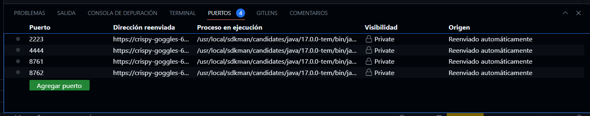
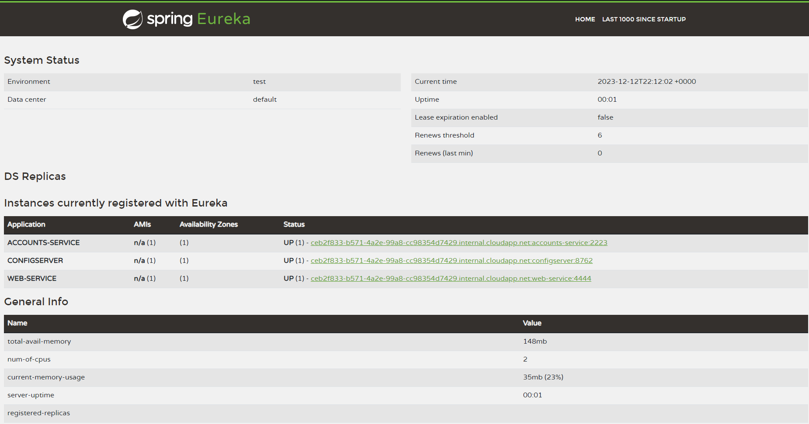
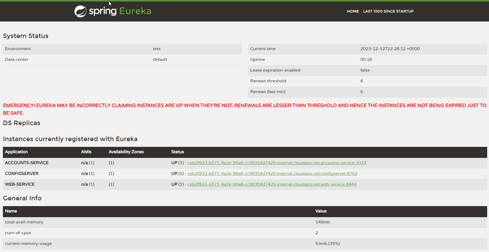
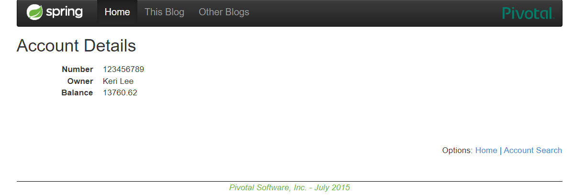

# Informe del laboratorio de microservicios

- Se tuvo que cambiar el puerto del servicio `accounts` de `2222` a `2223` ya que el puerto `2222` estaba ocupado por otro servicio y no funcionaba: [Enlace al commit](https://github.com/meritakete22/lab6-microservices-config-repo/tree/a1d23f8ffbf482f539f77dd039cda127bb85f032)

## Configuración del repositorio

- Creé mi propio repositorio de configuración basado en [este repositorio](https://github.com/UNIZAR-30246-WebEngineering/lab6-microservices-config-repo) y actualicé la configuración de mi servicio para usarlo. Aquí está el enlace a mi repositorio: [enlace al repositorio](https://github.com/meritakete22/lab6-microservices-config-repo)

## Servicios en ejecución

- Los servicios `accounts` y `web` están en ejecución y registrados. Aquí están las capturas de pantalla de los puertos: 

- El servicio de registro tiene estos dos servicios registrados. Aquí está la captura de pantalla del panel de Eureka:

## Actualización del repositorio de configuración

- Actualicé el repositorio de configuración para que el servicio `accounts` ahora use el puerto `3333`. [Enlace al commit](https://github.com/meritakete22/lab6-microservices-config-repo/tree/aec61b96c56b7f265887750766f3c07364f89d5e) 

- Ejecuté una segunda instancia del servicio `accounts` usando la nueva configuración. Aquí está lo que sucedió: 

- Lo que ocurre es que al cambiar el puerto se instancian 2 sercivicios del servicio account y ambas se registran en el servicio de enrutamiento(Eureka). Esto significa que si una de las instancias falla o se cierra, la otra puede seguir atendiendo las solicitudes. Esto proporciona una alta disponibilidad y resistencia a fallos

## Pruebas de resistencia

- Aquí está lo que sucedió cuando maté el servicio `accounts` (2222) e hice solicitudes a `web`:

- Cuando hago una solicitud a `web` después de matar el servicio `accounts` (2222), el servicio `web` sigue funcionando porque como se puede ver en la captura de pantalla, en Eureka sigue habiendo un servicio `accounts` (3333) registrado y el servicio `web` se comunica con él.

- Aquí está si el servicio `web` puede proporcionar información sobre las cuentas de nuevo y por qué: 
- Cuando matamos el servicio `accounts` (2222) y hacemos solicitudes a `web`, se sigue proporcionando información sobre las cuentas porque el servicio `web` se ha registrado en el servicio de registro y descubre el servicio `accounts` (3333) y se comunica con él.
